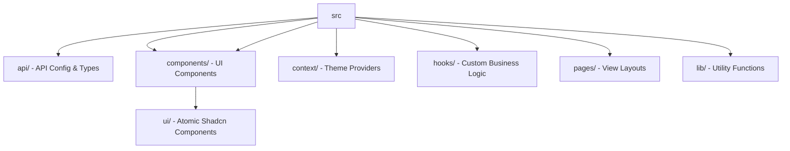

<div align="center">

# 🌤️ Klimate Dashboard
**Real‑time weather insights, beautifully visualized.**


[](https://www.typescriptlang.org/)
[](https://reactjs.org/)
[](https://vitejs.dev/)
[](https://tailwindcss.com/)
[](https://tanstack.com/query)

<p align="center">
  A high-performance, modern weather dashboard providing hyper-local weather data, interactive forecasts, and personalized city tracking with a seamless user experience.
</p>

---

</div>

## 📖 Overview

**Klimate** is a professional-grade weather application built with a focus on performance, accessibility, and aesthetic precision. By leveraging **TanStack Query** for efficient data fetching and **Shadcn UI** for a polished interface, Klimate transforms raw meteorological data into actionable insights.

The application features a dynamic dashboard that adapts to the user's location, tracks favorite cities, and provides detailed hourly and daily forecasts through a responsive, theme-aware interface.

## 🚀 Key Features

| Feature | Description | Tech Used |
| :--- | :--- | :--- |
| 🌍 **Geo-Location** | Automatic detection of user's current location for instant weather updates. | `use-geolocation` |
| 🔍 **Smart Search** | Fast city search with history tracking and autocomplete capabilities. | `cmdk` / `use-search-history` |
| 📈 **Visual Analytics** | Hourly temperature trends and detailed weather metrics. | `Recharts` / `Lucide React` |
| ❤️ **Favorites System** | Save and quickly access weather data for frequently visited cities. | `Local Storage` / `use-favorite` |
| 🌓 **Dynamic Theming** | Full support for Light and Dark modes for optimal viewing in any environment. | `next-themes` |
| ⚡ **Optimistic UI** | Skeleton loaders and cached data for a perceived zero-latency experience. | `TanStack Query` / `Shadcn UI` |

## 🛠️ Tech Stack

### Core Architecture
- **Frontend Framework:** React 18 + TypeScript
- **Build Tool:** Vite (Lightning fast HMR)
- **State Management:** TanStack Query (Server-state caching & synchronization)
- **Styling:** Tailwind CSS + Radix UI (via Shadcn UI)

### Infrastructure & Utilities
- **Routing:** React Router DOM
- **Date Handling:** `date-fns`
- **Icons:** Lucide React
- **Animations:** Tailwind Animate CSS

## 📂 Project Structure



<details>
<summary><b>Detailed File Tree</b></summary>

```text
src/
├── api/
│   ├── config.ts          # API Base configuration
│   ├── types.ts           # TypeScript interfaces for Weather data
│   └── weather.ts         # Fetching logic for weather endpoints
├── components/
│   ├── city-search.tsx    # Search bar with command palette
│   ├── current-weather.tsx# Main weather display card
│   ├── favorite-cities.tsx# List of saved locations
│   ├── weather-forecast.tsx# Daily forecast grid
│   └── ui/                # Shadcn UI primitives (Button, Card, Dialog, etc.)
├── hooks/
│   ├── use-weather.ts     # Core weather data fetching hook
│   ├── use-geolocation.ts # Browser geolocation wrapper
│   └── use-favorite.ts    # LocalStorage logic for favorites
├── pages/
│   ├── weather-dashboard.tsx # Main landing experience
│   └── city-page.tsx         # Detailed view for specific cities
└── lib/
    └── utils.ts           # Tailwind merge and utility helpers
```
</details>

## ⚙️ Getting Started

### Prerequisites
- **Node.js** (v18 or higher)
- **npm** or **yarn**
- An API Key from a weather provider (e.g., OpenWeatherMap)

### Installation

1. **Clone the repository**
   ```bash
   git clone https://github.com/dharunkumar-sh/klimate-dashboard.git
   cd klimate-dashboard
   ```

2. **Install dependencies**
   ```bash
   npm install
   ```

3. **Environment Setup**
   Create a `.env` file in the root directory:
   ```env
   VITE_WEATHER_API_KEY=your_api_key_here
   ```

4. **Run the development server**
   ```bash
   npm run dev
   ```

## 💻 Usage

### Core Logic Example
The application uses a custom hook pattern to decouple API logic from the UI:

```typescript
// Example of how weather data is consumed
const { data, isLoading, error } = useWeather(cityId);

if (isLoading) return <LoadingSkeleton />;
if (error) return <Alert variant="destructive">Error fetching weather</Alert>;

return <CurrentWeather data={data} />;
```

## 🤝 Contributing

Contributions are welcome! Please follow these steps:

1. Fork the Project
2. Create your Feature Branch (`git checkout -b feature/AmazingFeature`)
3. Commit your Changes (`git commit -m 'Add some AmazingFeature'`)
4. Push to the Branch (`git push origin feature/AmazingFeature`)
5. Open a Pull Request

## 📄 License

This project is currently unlicensed. Please contact the author for usage permissions.

---
<div align="center">
  Built with ❤️ by <a href="https://github.com/dharunkumar-sh">Dharun Kumar</a>
</div>
